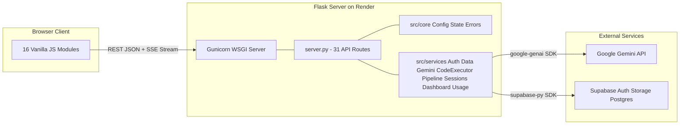
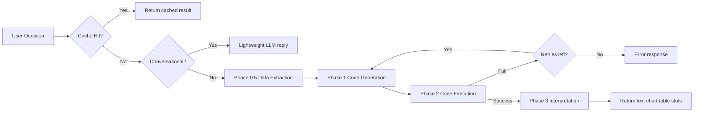

# Data Talk

**Data Talk** is an AI-powered, chat-based data analysis platform that lets you explore and visualise datasets through natural conversation. Upload a CSV or Excel file, ask questions in plain English, and get answers with auto-generated interactive charts — no coding required. Powered by Google's Gemini AI.

---

## ✨ Features

- **Conversational Data Analysis:** Chat directly with your data using Gemini AI — ask any question in natural language.
- **Automated Data Cleaning:** The system handles messy data, standardising columns and types behind the scenes before analysis.
- **Instant Visualisations:** Request bar charts, scatter plots, or any chart type — the AI writes and executes the code to generate interactive Plotly charts directly in the chat.
- **Dashboard Canvas:** Pin charts and KPI stat cards to a drag-and-drop GridStack dashboard. Customise titles, background colours, trace colours, and axis labels with a live-preview customiser panel.
- **Dashboard Export:** Export the dashboard canvas to PDF or PNG with configurable page size and background options.
- **Data Connector:** Upload CSV/Excel files, view and edit data in an interactive Handsontable grid, and save changes back to cloud storage.
- **Post-Upload Guidance:** First-time users are guided with a "What's Next?" panel after uploading their first dataset.
- **Multi-Session Conversations:** Maintain up to 2 separate conversation threads, each with independent chat history and dashboard state.
- **Secure Code Execution:** Python code generated by the LLM is executed in a controlled, sandboxed backend environment with AST validation.
- **Secure Authentication & Cloud Storage:** User accounts and datasets are securely managed with Supabase Auth (JWT + httpOnly cookies) and Supabase Storage.
- **Password Reset Flow:** Users can request password reset emails and set new passwords securely via the login page.
- **User Profiles:** Editable display names and avatar initials on a dedicated profile page.
- **Usage Tracking:** Real-time sidebar display of remaining messages, token counts, and cost (USD/MYR).
- **Inactivity Timeout:** Auto-logout after 10 minutes of idle time to protect user sessions.
- **Smart Questions:** AI-generated contextual question suggestions based on the active dataset.

---

## 🛠️ Technology Stack

### Backend

- **Python 3.12** with **Flask 3.1.0**
- **Gunicorn 23.0.0** — production WSGI server (used on Render)
- **Google GenAI SDK** (`google-genai`) — Gemini 3.1 Flash Lite
- **Pandas 2.2.3** / **NumPy 2.2.2** — data manipulation
- **OpenPyXL** — Excel file parsing
- **python-dotenv** — environment configuration
- **Supabase** — Auth and Storage for secure user sessions and dataset management
- **Flask-Limiter** — API rate limiting
- **Flask-CORS** — Cross-origin resource sharing

### Frontend

- **Vanilla JavaScript** (ES6+) — no frameworks
- **Plotly.js 2.35.0** — interactive charting
- **Handsontable** — spreadsheet grid component
- **Marked.js** + **DOMPurify** — safe markdown rendering
- **SheetJS (xlsx)** — client-side Excel file reading
- **GridStack 10** — dashboard drag-and-drop layout
- **html2canvas** + **jsPDF** — dashboard export to PNG/PDF

### Data Formats

- `.csv`, `.xlsx`, `.xls`

---

## 🏗️ Architecture Overview

DataTalk uses a **Client-Server** architecture with a vanilla JS SPA frontend and a Flask backend. Communication is via **REST (JSON)** and **SSE streaming** for real-time chat responses.



### The Analysis Pipeline (How Questions Are Answered)

When a user asks a question, the system runs a **multi-phase pipeline** — each phase streams progress to the browser via **Server-Sent Events**:



---

## 🚀 Getting Started

### 1. Prerequisites

- **Python 3.12+**
- A **Google Gemini API Key** — get one from [Google AI Studio](https://aistudio.google.com/).
- A **Supabase Project** — create one at [supabase.com](https://supabase.com/).

### 2. Supabase Setup

Create the following tables in your Supabase project:

**`profiles` table:**

| Column              | Type            | Notes                                     |
| ------------------- | --------------- | ----------------------------------------- |
| `id`              | `uuid`        | Primary key, references `auth.users.id` |
| `display_name`    | `text`        |                                           |
| `avatar_initials` | `text`        | Max 2 characters                          |
| `email`           | `text`        |                                           |
| `updated_at`      | `timestamptz` |                                           |

**`chat_sessions` table:**

| Column          | Type            | Notes                             |
| --------------- | --------------- | --------------------------------- |
| `id`          | `uuid`        | Primary key                       |
| `user_id`     | `uuid`        | References `auth.users.id`      |
| `session_id`  | `text`        | Unique session identifier         |
| `title`       | `text`        | Auto-generated from first message |
| `filename`    | `text`        | Associated dataset                |
| `messages`    | `jsonb`       | Full message history              |
| `token_usage` | `jsonb`       | Token counts and costs            |
| `updated_at`  | `timestamptz` |                                   |

**`dashboard_configs` table:**

| Column         | Type            | Notes                                        |
| -------------- | --------------- | -------------------------------------------- |
| `id`         | `uuid`        | Primary key                                  |
| `user_id`    | `uuid`        | References `auth.users.id`                 |
| `config`     | `jsonb`       | Dashboard state (charts + cards per session) |
| `updated_at` | `timestamptz` |                                              |

**Supabase Storage:** Create a bucket named `datasets` with RLS policies scoped to `auth.uid()`.

### 3. Environment Configuration

Create a `.env` file in the root directory:

```env
GEMINI_API_KEY=your-api-key-here
GEMINI_MODEL_ID=gemini-3.1-flash-lite
SUPABASE_URL=your-supabase-url
SUPABASE_ANON_KEY=your-anon-key
SUPABASE_SERVICE_ROLE_KEY=your-service-role-key
HTTPS_ENABLED=
ALLOWED_ORIGINS=
```

| Variable                      | Required | Description                                                                                                                |
| ----------------------------- | -------- | -------------------------------------------------------------------------------------------------------------------------- |
| `GEMINI_API_KEY`            | ✅ Yes   | Your Google Gemini API key from[AI Studio](https://aistudio.google.com/)                                                      |
| `GEMINI_MODEL_ID`           | No       | LLM model to use (default:`gemini-3.1-flash-lite`)                                                                       |
| `SUPABASE_URL`              | ✅ Yes   | Your Supabase project URL (e.g.`https://xxxxx.supabase.co`)                                                              |
| `SUPABASE_ANON_KEY`         | ✅ Yes   | Supabase anonymous/public key for client-side auth                                                                         |
| `SUPABASE_SERVICE_ROLE_KEY` | ✅ Yes   | Supabase service role key for server-side admin operations                                                                 |
| `HTTPS_ENABLED`             | No       | Set to `true` to enable HTTPS with self-signed certs (local dev only)                                                    |
| `ALLOWED_ORIGINS`           | No       | Comma-separated list of allowed CORS origins (e.g.`https://your-app.onrender.com`). Falls back to `localhost` if empty |

### 4. Deployment on Render

This project is deployed on [Render](https://render.com/) using **Gunicorn** as the production WSGI server.

**How it works:**

1. Render reads the `Procfile` to know how to start the app:
   ```
   web: gunicorn server:app --bind 0.0.0.0:$PORT --workers 1 --threads 4 --timeout 120
   ```
2. Render reads `runtime.txt` to know which Python version to use (`3.12.8`).
3. Render automatically installs dependencies from `requirements.txt`.
4. Set all `.env` variables as **Environment Variables** in the Render dashboard (Settings → Environment).

**Important Render settings:**

- Set `ALLOWED_ORIGINS` to your Render app URL (e.g. `https://datatalk-xxxx.onrender.com`)
- Leave `HTTPS_ENABLED` empty — Render handles HTTPS/SSL automatically

### 5. Running Locally (Development)

```bash
# 1. Create a virtual environment (recommended)
python -m venv .venv
.venv\Scripts\activate

# 2. Install dependencies
pip install -r requirements.txt

# 3. Start the server
python server.py
```

Then navigate to `http://localhost:5000` in your web browser.

---

## 📂 Project Structure

```
├── server.py                       # Flask entry-point — static files, all route handlers
├── Procfile                        # Render deployment command (Gunicorn)
├── runtime.txt                     # Python version for Render (3.12.8)
├── requirements.txt                # Python dependencies (pinned versions)
├── .env                            # Environment variables (not committed to git)
├── src/
│   ├── core/
│   │   ├── app_config.py           # Environment variable parsing, all config constants
│   │   ├── app_state.py            # QueryCache (LRU), UserState, SessionManager
│   │   ├── errors.py               # Custom error classes (DataTalkError hierarchy)
│   │   ├── pagination.py           # Shared pagination helper
│   │   └── value_utils.py          # Pandas/NumPy → native Python type conversion
│   └── services/
│       ├── analysis_pipeline.py    # Multi-phase chat analysis orchestrator
│       ├── auth_service.py         # Supabase Auth, JWT verification, @require_auth
│       ├── chat_session_service.py # Multi-session conversation management
│       ├── code_executor.py        # Sandboxed subprocess execution with AST validation
│       ├── dashboard_store.py      # Dashboard state read/write (Supabase Postgres)
│       ├── data_service.py         # Data loading, schema generation, profiling
│       ├── gemini_service.py       # LLM prompts, code generation, interpretation
│       ├── rate_limit_store.py     # Persist rate-limit timestamps to Supabase
│       └── usage_service.py        # Rate-limit tracking, token metering, cost calc
├── public/
│   ├── index.html                  # Landing page (marketing / hero section)
│   ├── login.html                  # Login, signup, password reset, password update
│   ├── dashboard.html              # Main SPA: sidebar, chat, data grid, dashboard
│   └── profile.html                # User profile settings page
├── js/
│   ├── constants.js                # Config constants (chart heights, timeouts)
│   ├── auth-client.js              # Browser auth (httpOnly cookie sessions)
│   ├── ui-utils.js                 # Confirm dialog, fetchApiJson, assertApiSuccess
│   ├── core.js                     # Global App state, particles, view switching, DOMReady
│   ├── chat-render.js              # Chat message DOM, Plotly charts, tables, stats
│   ├── chat.js                     # SSE streaming, message send/receive, history
│   ├── sessions.js                 # Conversation session CRUD, modal, list rendering
│   ├── upload.js                   # File upload, grid init, dataset loading/saving
│   ├── usage.js                    # Usage tracking sidebar, auto-refresh timer
│   ├── inactivity-timer.js         # 10-minute idle auto-logout
│   ├── data-chat.js                # Glue: path helpers, error display, sidebar init
│   ├── dashboard-ui.js             # Pin chart, smart questions, data preview, fullscreen, export
│   ├── dashboard-grid.js           # GridStack init, layout persistence, resize sweep
│   ├── dashboard-widgets.js        # Chart/KPI card widget rendering, remove/clear
│   ├── dashboard-customizer.js     # Live Plotly chart customisation panel
│   └── dashboard-cards.js          # KPI card modal, column loading, submit
├── css/
│   ├── styles.css                  # Global typography, colours, buttons, landing page
│   ├── dashboard-layout.css        # Sidebar, navigation, main container, grid layout
│   ├── dashboard-chat.css          # Chat pane, overlays, messages, input, upload guide
│   └── data-dashboard.css          # GridStack dashboard, chart containers, customiser
└──── assets/                         # Custom illustrated PNG characters + favicon (8 files)
```

## 🔌 API Endpoints

| Endpoint                             | Method   | Description                                           |
| ------------------------------------ | -------- | ----------------------------------------------------- |
| `/api/health`                      | GET      | Health check for Render liveness probes               |
| `/api/upload`                      | POST     | Upload a CSV/Excel file                               |
| `/api/files`                       | GET      | List uploaded files for user                          |
| `/api/data/<filename>`             | GET      | Full dataset for grid display                         |
| `/api/data/<filename>`             | PUT      | Save edited dataset content                           |
| `/api/data-summary/<filename>`     | GET      | Summary statistics (shape, dtypes, preview)           |
| `/api/suggest-questions`           | GET      | AI-generated contextual question suggestions          |
| `/api/chat`                        | POST     | Non-streaming analysis (4-phase pipeline)             |
| `/api/chat/stream`                 | POST     | SSE streaming analysis (real-time phase updates)      |
| `/api/chat/history`                | GET      | Retrieve chat message history (paginated)             |
| `/api/chat/sessions`               | GET      | List all conversation sessions                        |
| `/api/chat/sessions/new`           | POST     | Create a new conversation session                     |
| `/api/chat/sessions/<id>/activate` | POST     | Activate an existing session                          |
| `/api/chat/sessions/<id>`          | DELETE   | Delete a conversation session                         |
| `/api/chat/clear`                  | POST     | Reset all state, history, and dashboard               |
| `/api/dashboard`                   | GET/POST | Get or update dashboard configuration                 |
| `/api/dashboard/pin`               | POST     | Pin a chart to the dashboard                          |
| `/api/dashboard/remove/<id>`       | DELETE   | Remove a chart from the dashboard                     |
| `/api/dashboard/card-data`         | POST     | Compute KPI aggregation value (count, sum, avg, etc.) |
| `/api/usage/summary`               | GET      | Token/cost totals and remaining request budget        |
| `/api/auth/signup`                 | POST     | Register new user (Supabase Auth)                     |
| `/api/auth/login`                  | POST     | Authenticate user, return JWT tokens                  |
| `/api/auth/logout`                 | POST     | Sign out user                                         |
| `/api/auth/session`                | GET      | Validate current session, return user profile         |
| `/api/auth/reset-password`         | POST     | Request a password reset email                        |
| `/api/auth/update-password`        | POST     | Update password using recovery token                  |
| `/api/profile`                     | POST     | Update account display name/profile settings          |
| `/api/profile`                     | DELETE   | Delete user account                                   |

---

## 🔒 Security

The code executor (`code_executor.py`) runs AI-generated Python on the server with the following safeguards:

- **AST validation** — code is parsed and checked before execution
- **Module/attribute allowlists** — only safe builtins (`pd`, `np`, `len`, `range`, etc.) are permitted
- **Blocked modules** — `os`, `sys`, `subprocess`, `socket`, `pathlib`, `shutil`, `ctypes`, etc.
- **Subprocess isolation** — code runs in a spawned child process, not the main server
- **60-second timeout** — prevents runaway execution
- **10,000 character limit** — prevents dataset hardcoding in generated code
- **Cloud Storage** — datasets are stored securely in Supabase Storage instead of the local filesystem
- **API Authentication** — routes are protected by Supabase JWT verification (`@require_auth`)
- **httpOnly Cookies** — auth tokens are stored in secure httpOnly cookies, not localStorage
- **XSS prevention** — all rendered content sanitised with DOMPurify
- **Inactivity Timeout** — automatic logout after 10 minutes of idle time
- **Rate Limiting** — Flask-Limiter enforces per-user request budgets
- **CORS** — only whitelisted origins (via `ALLOWED_ORIGINS`) can access the API

---
